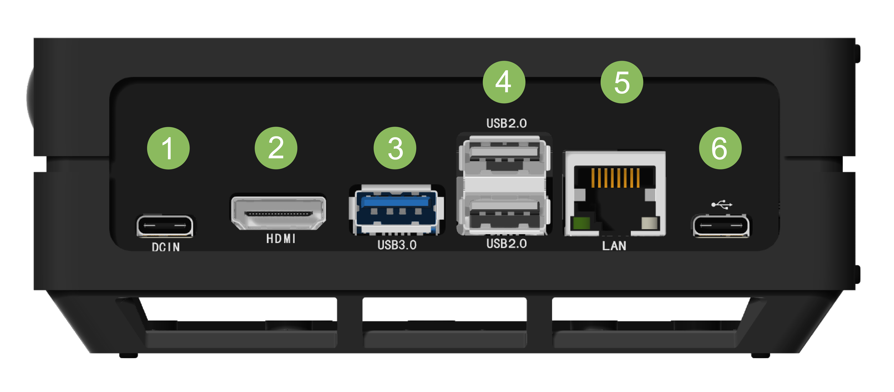

# Lab 1: Edge AI Platform and Baseline Inference

## Learning Objectives

By the end of this laboratory, you will be able to:

- Describe the role of an edge AI platform in an AIoT system.
- Identify the major hardware components of an NVIDIA Jetson platform.
- Verify the Jetson hardware and software environment.
- Interpret CPU, GPU, memory, and temperature measurements.
- Verify a CSI camera as an AIoT sensing device.
- Identify and use a shared Jetson-Inference software environment.
- Run a pretrained AI model on the Jetson.
- Explain the data path from physical sensing to local AI inference.

---

## Background

Artificial Intelligence of Things (AIoT) combines sensing, communication,
computing, and artificial intelligence to enable intelligent decision-making
close to where data is generated.

In this laboratory:

- the **CSI camera** serves as the sensing device;
- the **NVIDIA Jetson** serves as the edge AI computing platform;
- a **pretrained neural network** performs AI inference locally.

A simplified AIoT pipeline is:

```text
Physical Environment
        ↓
      Sensor
        ↓
   Edge Computing
        ↓
    AI Inference
        ↓
      Decision
```

The objective of this laboratory is not to learn every detail of Linux or
Jetson configuration. Instead, you will verify the platform, understand its
software environment, and run a baseline AI inference experiment.

---

## Equipment

Each team should have:

- NVIDIA Jetson / Seeed Studio reComputer
- Sony IMX219 CSI camera
- HDMI monitor
- Keyboard
- Mouse
- Power adapter
- Network connection

---

## Team Organization

For a three-person team, assign the following roles:

1. **Operator** – operates the Jetson and enters commands.
2. **Guide** – follows this instruction page and identifies the next step.
3. **Recorder/Analyst** – records observations and completes the Submission Sheet.

Rotate roles during the laboratory when practical. Students with previous Jetson/Linux experience should help explain commands
and observations rather than completing all tasks for the team.

---

# Part 1 – Hardware Overview

Before powering on the system, identify the major interfaces shown in Figure 1.



**Figure 1. External interfaces of the Seeed Studio reComputer.**

| Label | Interface | Function |
|---|---|---|
| 1 | DC Power | Supplies power to the Jetson |
| 2 | HDMI | Display output |
| 3 | USB 3.0 | High-speed peripherals |
| 4 | USB 2.0 | Keyboard and mouse |
| 5 | Ethernet | Wired network connection |
| 6 | USB-C | Device interface, if applicable |

Think about the roles of:

- sensing,
- computation,
- communication,

in an AIoT system.

### Submission

Complete **Part 1 of the Submission Sheet**.

---

# Part 2 – System Verification

Connect the monitor, keyboard, mouse, camera, and power supply.

After the Jetson boots, open a terminal.

Use the following commands to identify the system.

## Check Ubuntu Version

```bash
lsb_release -a
```

or:

```bash
cat /etc/os-release
```

## Check Jetson / L4T Release

```bash
cat /etc/nv_tegra_release
```

Example:

```text
R32 (release), REVISION: 7.1
```

## Examine CPU Information

```bash
lscpu
```

## Check Number of CPU Cores

```bash
nproc
```

## Check System Memory

```bash
free -h
```

`free -h` reports total, used, free, and available system memory in
human-readable units.

You do not need to record every line generated by these commands.
Identify the information requested in the Submission Sheet.

### Submission

Complete **Part 2 of the Submission Sheet**.

---

# Part 3 – Resource Monitoring

An edge AI device has limited computing, memory, power, and thermal resources
compared with a workstation or cloud server.

Run:

```bash
tegrastats
```

Observe information related to:

- RAM usage
- CPU utilization
- CPU frequency
- GPU activity, if reported
- GPU temperature
- other system temperatures
- power information, if reported by the platform

Example:

```text
RAM 1620/3956MB
GPU@25.5C
CPU [2%@1224,2%@1224,4%@1224,3%@1224]
```

Different Jetson configurations may report somewhat different fields.

Let `tegrastats` run for several seconds.

Press:

```text
Ctrl + C
```

to stop monitoring.

Think about why these measurements are important when selecting and deploying
AI models on embedded edge devices.

### Submission

Record one representative `tegrastats` result and complete
**Part 3 of the Submission Sheet**.

---

# Part 4 – Camera Verification

The CSI camera acts as the sensing device in this AIoT system.

Check the available video devices:

```bash
v4l2-ctl --list-devices
```

A typical output may look like:

```text
vi-output, imx219 8-0010 (platform:54080000.vi:4):

    /dev/video0
```

You may also use:

```bash
ls /dev/video*
```

A simplified camera data path is:

```text
Physical Scene
      ↓
IMX219 Camera
      ↓
CSI Interface
      ↓
Jetson Video Input
      ↓
Linux Video Device
      ↓
/dev/video0
```

Interpret what the output tells you about the camera and how applications can
access it.

### Submission

Complete **Part 4 of the Submission Sheet**.

---

# Part 5 – Team Workspace

Multiple teams share the same Jetson systems and the same Jetson-Inference
installation.

Each team should therefore keep its own experimental files in a separate
workspace.

For example, Team 1 can create:

```bash
cd ~
mkdir -p AIoT_Lab/team1/{inputs,outputs,notes}
```

Check the directory:

```bash
ls ~/AIoT_Lab/team1
```

Expected folders:

```text
inputs
notes
outputs
```

Replace `team1` with your team name.


## Important

Because the Jetson is shared:

- Do not delete shared software.
- Do not reinstall or update system software unless instructed.
- Do not modify another team's files.
- Store your own results, images, screenshots, notes, and code inside your
  assigned team directory.

### Submission

Record your team workspace in **Part 5 of the Submission Sheet**.

No screenshot is required.

---

# Part 6 – Edge AI Software Environment

The Jetson-Inference software environment is **shared by all teams using the
same Jetson**.

You do **not** need to download another copy.

First, check that the repository exists:

```bash
cd ~
ls
```

Look for:

```text
jetson-inference
```

Enter the repository:

```bash
cd ~/jetson-inference
```

Record the exact version:

```bash
git rev-parse HEAD
```

The output is a **Git commit ID** that uniquely identifies the version of
Jetson-Inference being used.

Explore the repository:

```bash
ls
```

Next, locate the compiled inference programs:

```bash
cd ~/jetson-inference/build/aarch64/bin
```

Check the available inference programs:

```bash
ls imagenet* detectnet* segnet* posenet*
```

These programs represent several computer-vision tasks:

| Program | AI Task |
|---|---|
| `imagenet` | Image classification |
| `detectnet` | Object detection |
| `segnet` | Semantic segmentation |
| `posenet` | Human pose estimation |

## Important

Do **not** reinstall, update, or modify the shared Jetson-Inference
installation unless instructed by the instructor.

### Submission

Record the Jetson-Inference commit ID and complete
**Part 6 of the Submission Sheet**.

---

# Part 7 – Baseline AI Inference

In this part, you will run a pretrained neural network on a stored image.

The basic inference pipeline is:

```text
Stored Image
     ↓
Pretrained Neural Network
     ↓
Jetson GPU
     ↓
AI Inference
     ↓
Prediction / Annotated Output
```

## Step 1 – Go to the Inference Program Directory

```bash
cd ~/jetson-inference/build/aarch64/bin
```

## Step 2 – Run Image Classification

Use the provided orange image with a pretrained ResNet-18 model:

```bash
./imagenet images/orange_0.jpg images/test/output_0.jpg --model=resnet18
```

The resulting image will be saved as:

```text
images/test/output_0.jpg
```

Open the result:

```bash
xdg-open images/test/output_0.jpg
```

Observe:

- the input image;
- the predicted class;
- the confidence, if displayed;
- the annotated output.

## Step 3 – Save a Copy in Your Team Workspace

For Team 1:

```bash
cp images/test/output_0.jpg ~/AIoT_Lab/team1/outputs/
```

Replace `team1` with your team number.

Verify:

```bash
ls ~/AIoT_Lab/team1/outputs
```

## Optional: Explore Another AI Task

If time permits, you may try one of the following.

### Object Detection

```bash
./detectnet.py --network=ssd-mobilenet-v2 images/peds_0.jpg images/test/output.jpg
```

### Semantic Segmentation

```bash
./segnet.py --network=fcn-resnet18-cityscapes images/city_0.jpg images/test/output.jpg
```

### Pose Estimation

```bash
./posenet "images/humans_*.jpg" images/test/pose_humans_%i.jpg
```

These additional examples are optional for Lab 1.

### Submission

Complete **Part 7 of the Submission Sheet** and include one representative
baseline inference result.

---

# Part 8 – Live Camera Inference and Remote Streaming

**Complete this part if time permits.**

In this part, you will replace the stored image used in Part 7 with a live physical scene captured by the CSI camera.

The processing pipeline becomes:

```text
Physical Scene
      ↓
CSI Camera
      ↓
Jetson
      ↓
Pretrained AI Model
      ↓
Real-Time Inference
      ↓
WebRTC Streaming
      ↓
Remote Browser
```

---

## Step 1 – Verify the CSI Camera

Run:

```bash
v4l2-ctl --list-devices
```

Confirm that the Sony IMX219 CSI camera is detected.

A typical result is:

```text
vi-output, imx219 8-0010 (platform:54080000.vi:4):

    /dev/video0
```

You may also check:

```bash
ls /dev/video*
```

---

## Step 2 – Test the Live CSI Camera

Navigate to the Jetson-Inference binary directory:

```bash
cd ~/aiot_Course/jetson-inference/build/aarch64/bin
```

Run:

```bash
./video-viewer csi://0
```

A local window should display the live CSI-camera feed.

If the live video appears correctly, press:

```text
Ctrl + C
```

to stop the program.

> Note: For this CSI camera, use `csi://0` rather than `/dev/video0` as the Jetson-Inference camera input.

---

## Step 3 – Find the Jetson IP Address

Run:

```bash
ip addr show
```

Look for the active network interface, such as Wi-Fi (`wlan0`) or Ethernet (`eth0`).

Find the line beginning with:

```text
inet
```

For example:

```text
inet 172.22.60.84/21
```

In this example, the Jetson IP address is:

```text
172.22.60.84
```

Do not use:

```text
127.0.0.1
```

because that address refers only to the local Jetson itself.

Record your Jetson IP address:

```text
____________________________________________
```

---

## Step 4 – Test Remote Camera Streaming

From the Jetson, run:

```bash
./video-viewer csi://0 webrtc://@:8554/output
```

Leave this terminal running.

On a laptop connected to the same network, open a web browser and go to:

```text
http://<JETSON-IP>:8554
```

Replace `<JETSON-IP>` with the address found in Step 3.

For example:

```text
http://172.22.60.84:8554
```

You should see the live CSI-camera stream in the remote browser.

> In the instructor-tested configuration, the WebRTC page uses `http://` rather than `https://`.

---

## Step 5 – Verify Network Connectivity If Needed

If the remote browser cannot reach the Jetson, first verify that the WebRTC server is running.

Open another terminal on the Jetson and run:

```bash
ss -ltnp | grep 8554
```

A successful result should indicate that `video-viewer` is listening on port `8554`.

For example:

```text
LISTEN ... 0.0.0.0:8554 ...
```

From a Mac or Linux laptop, you may also test connectivity with:

```bash
nc -vz <JETSON-IP> 8554
```

For example:

```bash
nc -vz 172.22.60.84 8554
```

A successful connection may look like:

```text
Connection to 172.22.60.84 port 8554 succeeded!
```

If the connection succeeds but the browser does not load, confirm that you are using:

```text
http://<JETSON-IP>:8554
```

rather than HTTPS.

---

## Step 6 – Run Real-Time AI Inference

Stop `video-viewer` by pressing:

```text
Ctrl + C
```

Then run real-time object detection using the CSI camera:

```bash
./detectnet.py csi://0 webrtc://@:8554/output
```

The pipeline is now:

```text
Physical Scene
      ↓
CSI Camera
      ↓
Jetson
      ↓
Object Detection
      ↓
Bounding Boxes / Labels
      ↓
WebRTC
      ↓
Remote Browser
```

On the remote laptop, open:

```text
http://<JETSON-IP>:8554
```

Try placing different objects in front of the camera.

Observe:

- whether detected objects change as the scene changes;
- whether inference appears to operate in real time;
- one situation where detection performs well;
- one situation where the model misses an object or produces an unexpected result.

> Important: The required pretrained object-detection model must already be installed on the Jetson. If the model is missing, notify the instructor rather than attempting to download or reinstall models during the lab.

---

## Step 7 – Observe System Resources During Live Inference

Open a second terminal and run:

```bash
tegrastats
```

Compare the system behavior during live AI inference with the idle measurements collected in Part 3.

Observe changes in:

- RAM usage,
- CPU utilization,
- CPU frequency,
- GPU activity, if reported,
- GPU temperature,
- power, if reported.

Press:

```text
Ctrl + C
```

to stop `tegrastats`.

---

## Submission

Complete **Part 8 of the Submission Sheet**.

Include:

- whether live CSI-camera inference was completed;
- the Jetson IP address;
- the AI task and model used;
- one example where the model performed well;
- one example where the model produced an incorrect or unexpected result;
- one screenshot from the remote browser showing the live stream with inference overlays, if available.

---

# Part 9 – AIoT Reflection

Discuss the following questions within your team:

- Where is sensing performed?
- Where is AI inference performed?
- What resources are limited on the Jetson?
- What advantages does local inference provide?
- Why might an AIoT system also require wireless communication?
- What might happen if a larger neural network were used?

Consider the full system:

```text
Physical Environment
        ↓
      Camera
        ↓
      Jetson
        ↓
    AI Inference
        ↓
      Decision
        ↓
Communication / Application
```

### Submission

Complete **Part 9 of the Submission Sheet**.

The written reflection may be completed after the laboratory period.


