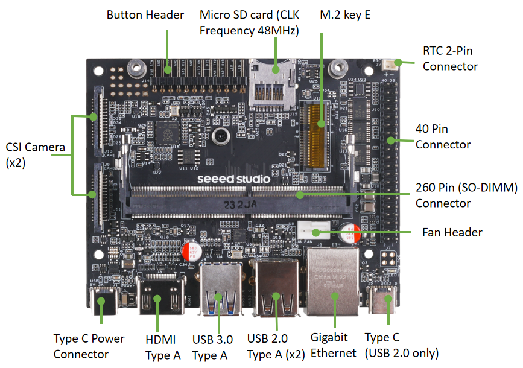
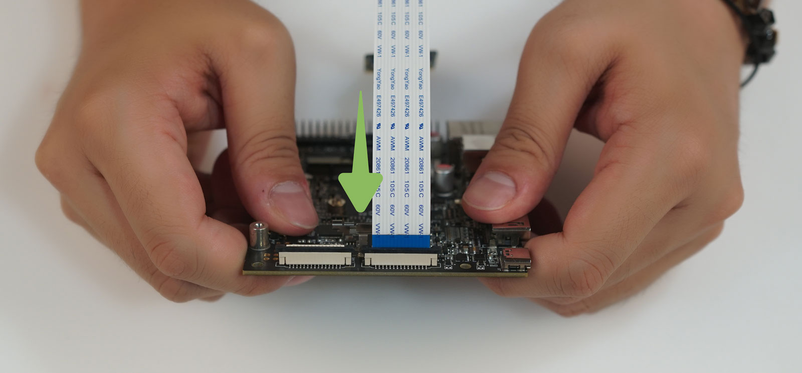

# AIoT Laboratory Exercises

Welcome to the hands-on component of **ECE 4930/6930 – Artificial Intelligence of Things (AIoT)**.

The laboratory exercises introduce the complete AIoT pipeline, from sensing and edge computing to efficient AI deployment and system integration. Throughout the semester, students will gain hands-on experience with NVIDIA Jetson edge AI platforms and XIAO ESP32-S3 development boards.

---

## Laboratory Hardware

The primary edge computing platform used in this course is the **Seeed Studio reComputer**, powered by the NVIDIA Jetson Nano.

**Figure 1.** The board of Seeed Studio reComputer.

Each laboratory station is preconfigured with:

- NVIDIA Jetson Nano (Seeed reComputer)
- Sony IMX219 CSI Camera
- HDMI monitor
- Keyboard and mouse
- Wi-Fi adapter
- Internet connection

The Jetson platform provides GPU acceleration for deep learning inference, making it an ideal platform for edge AI applications.

---

## CSI Camera Connection

The Sony IMX219 CSI camera is connected directly to the Jetson through the Camera Serial Interface (CSI). Compared with USB webcams, CSI cameras provide lower latency and better integration with the NVIDIA multimedia pipeline.

**Figure 2.** CSI camera connected to the Jetson platform.

---

## Laboratory Schedule

| Lab | Topic |
|------|-------|
| **Lab 1** | Introduction to Edge AI Computing |
| **Lab 2** | Real-Time Object Detection and Efficient AI |
| **Lab 3** | TinyML with XIAO ESP32-S3 |

---

## Laboratory Workflow

The laboratory exercises are designed to build progressively throughout the semester:

1. Become familiar with the Jetson edge AI platform.
2. Deploy AI models for real-time inference.
3. Analyze performance and optimize AI models.
4. Collect sensor data using the XIAO ESP32-S3.
5. Build a complete AIoT system integrating sensing, communication, and edge intelligence.
